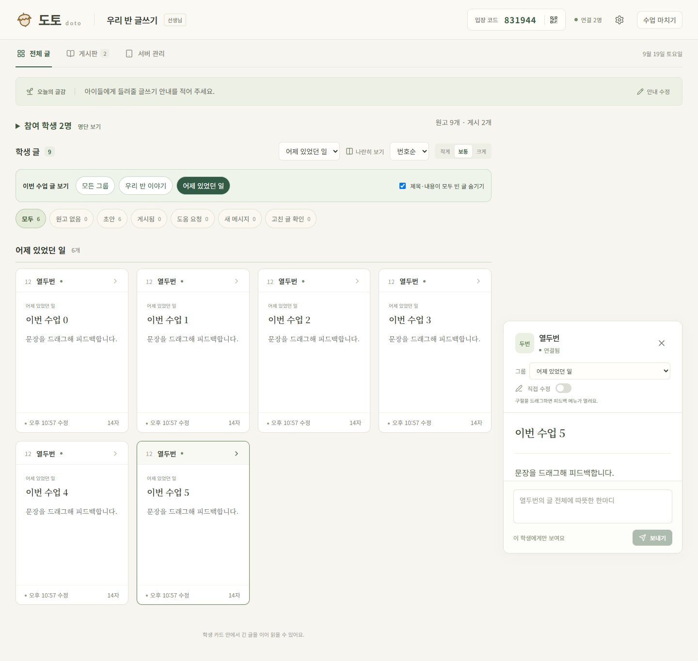
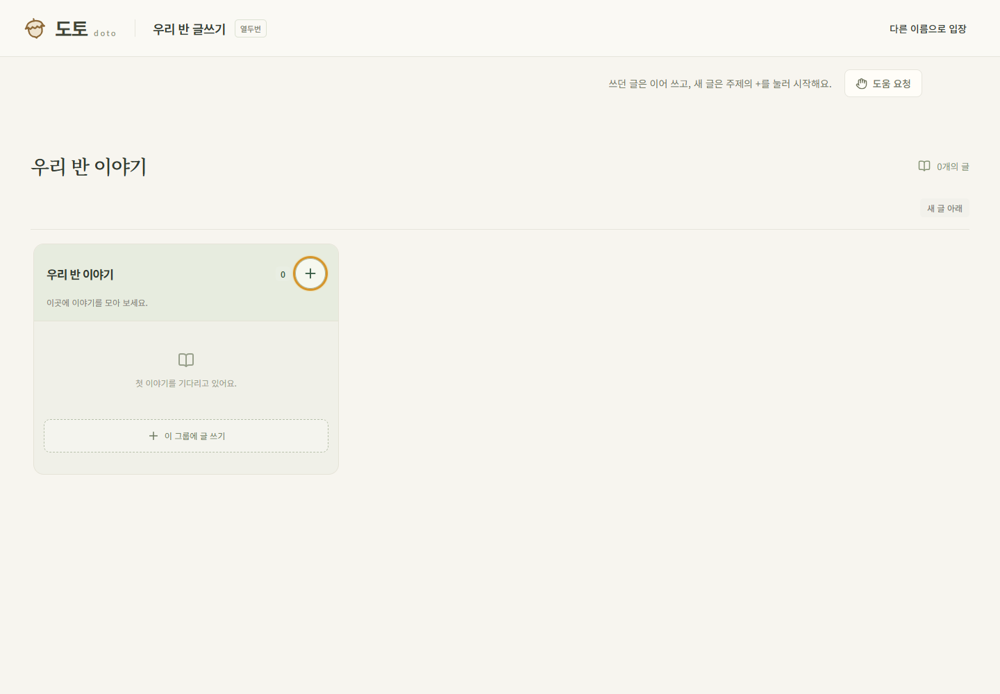
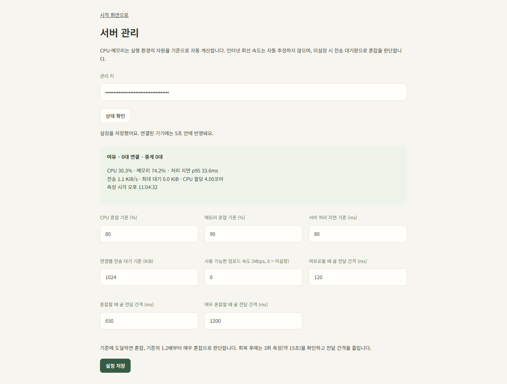
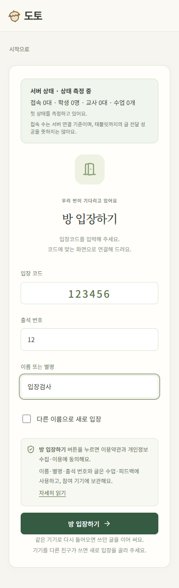

# 수업 화면·연결·서버 부하 개선 기록

2026-09-19. 수정 전 상태는 GitHub CLI로 원격 저장소를 확인한 뒤 `main`의 `c719bbf` 커밋으로 저장했다. 아래 변경은 그 상태를 기준으로 구현했다.

## 요청별 적용 내용

| 요청 | 적용 내용 |
| --- | --- |
| 1. 저장 상태 점멸 | 정상적인 저장 중·저장됨 문구와 시간을 숨겼다. 저장 실패와 연결 오류는 계속 알린다. |
| 2. 자동 중계 | 숫자 코드로 입장한 뒤 직접 연결을 시도한다. 실패 또는 약 8초 대기 후 같은 참가자의 중앙 WebSocket 중계로 전환한다. `*`는 연결 방식을 선택하지 않는다. |
| 3. 피드백 선택 유지 | 학생의 원격 입력이 브라우저 선택을 접어도 Yjs 상대 위치로 선택 구간을 유지한다. 스크롤 때 메뉴를 닫지 않고 위치를 조정한다. 선택 구절이 삭제되면 닫는다. |
| 4. 전체 글 스크롤 | 전체 글 안에서 원고 상세를 여는 동작은 페이지를 맨 위로 이동시키지 않는다. 읽기용 편집기의 자동 선택 스크롤도 막았다. |
| 5. 제목·본문 단독 게시 | 제목이나 본문 중 하나만 있어도 게시할 수 있다. 둘 다 공백인 글은 게시할 수 없다. 제목 없는 게시물에는 대체 표기를 사용한다. |
| 6. 그룹 구분·필터 | 기존 게시판의 주제 그룹을 전체 글에서도 독립된 구역으로 표시한다. 상단 ‘이번 수업 글 보기’ 버튼으로 특정 그룹만 볼 수 있고 같은 탭에서 선택을 유지한다. |
| 7. 빈 글 숨김 | ‘제목·내용이 모두 빈 글 숨기기’ 옵션을 추가했다. 해당 교사 브라우저에 보기 설정을 저장하며 문서를 삭제하지 않는다. |
| 8. 출석 번호 | 학생 입장에 1~9999 번호를 요구한다. 전체 글의 기본 정렬은 번호순이며 이름순·입장순도 유지한다. 이전 기록에 번호가 없으면 뒤에 배치한다. |
| 9. 버튼 강조 | 교사가 게시판의 공통 버튼을 우클릭하면 ‘이 버튼 강조’를 선택할 수 있다. 같은 화면에서 해당 버튼을 보고 있는 학생에게 약 3초 표시한다. |
| 10. 접속 전 서버 상태 | 시작·입장 화면에 접속 기기 수, 학생 수, 교사 기기 수, 수업 수, 혼잡 상태를 표시한다. `/admin/server`에서 실제 지표와 기준을 확인·수정한다. |
| 11. 가변 전달 간격 | 학생의 변경을 묶는 간격을 기본 120 / 500 / 1200ms로 조절한다. 입력 자체는 즉시 화면에 반영하고 게시 전에는 마지막 변경을 먼저 전달한다. |

## 연결과 재입장

연결 방식과 방·참가자 자격을 분리했다. 이전 저장 정보에 `relay`가 남아 있어도 입장 모드를 결정하지 않는다. 이전 링크의 선행 `*`는 호환성을 위해 제거하지만 중계를 강제하지 않는다. 새 학생 연결은 직접 연결부터 시도한다.

서버는 각 연결 시도에 새 식별자를 부여한다. 이전 시도에서 늦게 도착한 SDP·ICE·중계 요청은 식별자가 다르면 거부한다. 양쪽이 동시에 중계를 요청해도 이미 만든 중계 경로를 교체하지 않는다. 같은 기기로 복귀할 때 이름 중복으로 붙은 표시용 접미사가 학생 자격을 바꾸지 않도록 입력 이름도 별도로 보관한다.

중앙 서버는 직접 연결에 실패한 글 전달을 중계하며, 수업 호스트 태블릿을 대신하지 않는다. 호스트 화면과 네트워크는 계속 필요하다. 원고는 참여 기기의 브라우저에 보관하며 중앙 서버의 디스크에 저장하지 않는다.

## 버튼 강조 범위

학생에게도 존재하는 새 글·글 열기·펼치기·댓글·자료 그림, 같은 글의 닫기·댓글 등록 버튼에 명시적인 식별자를 부여했다. 교사 전용 관리 버튼은 대상이 아니다.

호스트는 요청자의 교사 권한과 현재 게시판에 존재하는 대상을 검사한다. 학생은 게시판/개별 글 화면 식별자가 일치하고 버튼이 화면에 실제로 보일 때만 표시한다. 다른 글의 대화창에 가려진 버튼, 글쓰기 화면, 숨겨진 탭에는 표시하지 않으며 화면 이동 후 재생하지 않는다. 이벤트는 수업 기록에 저장하지 않는다. 동작 줄이기 설정에서는 점멸 대신 테두리로 표시한다.

## 서버 상태와 관리자 설정

고정된 ‘최대 학생 수’를 혼잡 기준으로 사용하지 않는다. 5초마다 다음 자원 지표를 측정한다.

- CPU: 시스템 사용률과 할당 CPU 대비 Node 프로세스 사용률. Linux cgroup의 CPU 할당량도 반영한다.
- 메모리: 실행 환경에서 이용 가능한 메모리와 제약된 메모리 한도 대비 사용 비율.
- 처리 지연: Node 이벤트 루프 지연의 p95.
- 전송 대기: 연결별 WebSocket 대기 바이트의 최댓값.
- 회선: 관리자가 업로드 Mbps를 설정했을 때만 Doto의 WebSocket JSON 전송률을 비교한다. 회선의 실제 속도를 자동 측정하지 않는다.

각 지표를 설정한 혼잡 기준으로 나눈 비율 중 가장 큰 값으로 판단한다. 1 이상은 혼잡, 1.2 이상은 매우 혼잡이다. 더 나빠지면 즉시 간격을 늘리고, 더 나은 측정이 3회 이어진 뒤 간격을 줄인다. 따라서 회복에는 대략 15초가 걸린다. 한 명의 느린 중계 연결도 전송 대기 기준에 영향을 줄 수 있다.

공개 상태 화면은 10초마다 갱신하며 숨겨진 탭에서는 요청을 쉰다. 응답 실패·오래된 측정은 ‘확인할 수 없음’으로 표시하고 과거 접속 수를 현재 값처럼 표시하지 않는다. 접속 수는 중앙 서버에 연결된 인증 기기 기준이며, 개별 학생과 호스트 사이의 글 전달 성공을 보장하지 않는다.

관리 페이지를 사용하려면 서버 환경변수 `DOTO_ADMIN_TOKEN`에 24자 이상의 임의 관리 키를 설정하고 서버를 재시작한다. 관리 키는 브라우저 저장소에 저장하지 않는다. 기준과 전달 간격은 `data/server-tuning.json`에 보관한다. `DOTO_TUNING_FILE`로 경로를 바꿀 수 있으며 Compose에는 영속 볼륨을 추가했다. 관리 페이지에서 저장한 설정은 실행 중 반영된다. 공개 상태 응답에는 관리 키·학생 명단·세부 지표·설정값을 내보내지 않는다.

CPU·메모리 값은 서버 환경에 맞추지만 혼잡 기준과 지연 허용치는 수업 환경에 따라 조정할 수 있다. 회선 지표는 다른 프로그램의 트래픽, HTTP 파일, TLS 비용을 포함하지 않는다. 이 화면만으로 회선 전체의 혼잡이나 학교 Wi-Fi의 상태를 판정할 수는 없다.

## 예상 절감량

`node reports/adaptive-sync-estimate.mjs`로 재현할 수 있다. Yjs 문서에 30명이 각각 초당 5글자씩 60초간 연속 입력하는 경우를 계산했다. 실제 `Y.mergeUpdates`를 사용하고 적용 후 원문이 일치하는지도 검사한다. 메시지 크기는 한 방향의 중계 JSON과 ACK를 합산했다.

| 전달 간격 | 30명 변경 메시지 수 | 즉시 전달 대비 메시지 감소 | JSON·ACK 바이트 감소 |
| --- | ---: | ---: | ---: |
| 즉시 | 9,000 | 0% | 0% |
| 120ms | 9,000 | 0% | 0% |
| 500ms | 3,000 | 66.7% | 63.7% |
| 1200ms | 1,500 | 83.3% | 79.4% |

입력 간격이 200ms인 예시이므로 120ms에서는 묶을 입력이 없어 감소하지 않는다. 전달 지연은 네트워크와 수신 처리 시간에 더해 최대 설정 간격만큼 늘 수 있다. 학생 화면의 입력을 늦추지는 않는다. 교사 수정·피드백·접속 동기화는 학생 변경 묶음의 대기 대상이 아니다.

**이는 운영 서버 부하 시험이나 비용 절감 측정값이 아니다.** 중앙 중계를 쓰는 학생 비율과 입력 속도에 따라 효과가 달라진다. 직접 WebRTC로 전달되는 글은 원래 중앙 서버를 통과하지 않으므로 그 경로의 글 전달에 대한 중앙 서버 절감은 없다. 예를 들어 중계 경로에서 67% 줄더라도 해당 변경 트래픽이 전체 서버 트래픽의 절반이라면 전체 감소는 약 33%다.

초기 문서 동기화, 게시판 스냅샷, 연결 상태, 진단 로그, HTTP, WebSocket 프레임·TLS 비용은 계산에서 제외했다. 게시·화면 이동·저장 시점의 조기 전송으로 실제 묶음 수가 늘 수 있다. CPU·메모리·호스팅 요금의 감소율은 실서버에서 별도 측정해야 한다. [원시 계산 결과](adaptive-sync-estimate.json)를 함께 보관했다.

## 검증

- `npm run build`: 타입 검사와 배포 빌드 통과.
- HTTP LAN 환경의 Playwright 시나리오 14개 통과. 첫 실행의 관리자 API 2개는 Node 요청에 브라우저 전용 DNS 규칙이 적용되지 않아 실패했고, API 검사 주소를 수정한 뒤 두 시나리오 모두 통과했다. 나머지 12개는 앞 실행에서 통과했다.
- 로컬 브라우저에서도 수업·연결 진단·태블릿 호스트·동의·선택 유지·중계 묶음 전송을 확인했다.
- 서버 부하·관리자 인증·설정 저장, 중계 권한, 진단 정보 필터의 Node 검사 9개 통과. 게시판 순서 검사 6개 통과.
- signaling, tablet-host, trash, learning 스모크 검사 통과. 중계 동시 요청, 이전 연결 신호 거부, 재입장 자격 유지도 검사했다.
- 브라우저 검사에 학생 동시 입력 중 피드백 선택, 스크롤 유지, 제목/본문 단독 게시, 번호 정렬, 그룹 필터 저장, 빈 글 숨김, 같은 화면만 강조, 중계 전송량 감소, 게시 전 마지막 입력 보존, 관리자 인증 실패·설정 반영·키 미보관을 포함했다.

학교망의 실제 태블릿·한글 IME, 많은 학생의 동시 접속, 실서버 CPU·요금 절감은 이 검사에서 측정하지 않았다. 운영 서버의 배포·재시작은 실행하지 않았다. 적용 시 서버와 화면을 함께 업데이트하고 교사·학생 기기를 모두 새로고침해야 한다. 구버전 화면을 함께 사용하면 새 자동 중계 프로토콜을 이용할 수 없다.

## 확인 화면

## 구현 참고

- [Node.js 이벤트 루프 지연 측정](https://nodejs.org/api/perf_hooks.html#perf_hooksmonitoreventloopdelayoptions)
- [Yjs 업데이트 결합 API](https://github.com/yjs/yjs#alternative-update-api)
