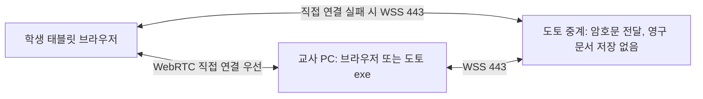

**도토의 학교망 연결 구조와 교사용 exe 도입 검토**

조사일: 2026-09-08. 현재 작업 폴더의 코드와 제품 공식 문서를 확인했다. 학교별 연결 성공률이나 N100 처리량을 실측한 보고서는 아니다. 아래 제품은 구현 사례이며, 한국 학교망에서 도토와 같은 조건으로 비교 시험했다는 뜻은 아니다.

교사용 exe와 학생용 브라우저라는 조합은 충분히 구현할 수 있다. 그러나 exe 자체가 학생망과 교사망 사이의 통신 차단을 없애지는 못한다. 도토에 권하는 방향은 **직접 연결을 기본으로 유지하고, 직접 연결이 안 되는 학생에게 HTTPS 기반 중계 경로를 자동 제공하는 것**이다. exe는 그 위에 자동 저장·백업·수업 유지 기능을 제공하는 선택지로 두는 편이 좋다.

중계 트래픽을 반드시 0으로 유지해야 한다면, 학생에서 교사 PC까지 통신이 허용된 내부망을 확보해야 한다. 학교의 통신 허용 설정, 승인된 교실 전용 공유기, 또는 두 망에서 접근 가능한 학교 내부 서버 중 하나가 필요하다. 네트워크 조건을 바꾸지 않고, 외부 중계도 사용하지 않으며, 모든 학교에서 주소 입력만으로 연결되게 만드는 일반적인 해법은 없다.

현재 도토에서는 다음 사실이 확인된다.

| 확인 사항 | 코드와 기록 | 판단에 미치는 영향 |
| --- | --- | --- |
| 중앙은 웹페이지·방·연결 신호를 처리한다 | [서버 설정과 WebSocket 처리](C:/Users/strata/Documents/ChatGPT/Doto/server/index.mjs:63) | 현재도 문서 처리의 대부분은 교사와 학생 기기에 있다. exe 포장만으로 중앙 연산량이 크게 더 줄지는 않는다. |
| STUN 주소만 받으며 TURN 설정을 제외한다 | [클라이언트 설정](C:/Users/strata/Documents/ChatGPT/Doto/src/classroom.ts:551), [PeerConnection 생성](C:/Users/strata/Documents/ChatGPT/Doto/src/classroom.ts:864) | 직접 연결이 막히면 서버 중계를 통한 복구가 불가능하다. STUN은 주소 발견을 돕고 문서를 중계하지 않는다. |
| 연결 준비에 약 20초 제한이 있고 문서 중계는 없다 | [사용 안내](C:/Users/strata/Documents/ChatGPT/Doto/README.md:81) | 수업 운영에서 네트워크별 차이를 사용자가 떠안는 구조다. |
| 과거 기록에는 입장과 신호 교환 성공 뒤 DataChannel 실패가 있다 | [2026-09-07 실제 접속 기록](C:/Users/strata/Documents/ChatGPT/Doto/design/연결진단_개선기록.md:32) | 웹 연결과 실제 직접 연결은 구분해야 한다. 당시 특정 방화벽 규칙이나 NAT 종류까지 확정된 것은 아니다. |
| 본문은 Yjs 변경분을 교사와 해당 학생 사이에 전달한다 | [문서 update 처리](C:/Users/strata/Documents/ChatGPT/Doto/src/classroom.ts:1159) | 현재 편집기를 유지하면서 전송 경로를 확장할 수 있다. |
| 교사 그림과 게시판은 전체 상태에 포함된다 | [그림 준비](C:/Users/strata/Documents/ChatGPT/Doto/src/GroupLearning.tsx:21), [상태 전송](C:/Users/strata/Documents/ChatGPT/Doto/src/classroom.ts:1056) | 글쓰기 서비스라도 전체 트래픽이 항상 작은 것은 아니다. 중계 도입과 함께 반복 전송을 줄여야 한다. |

exe로 해결되는 범위를 구분해야 한다.

| 네트워크 상태 | 교사 PC의 로컬 HTTP/WebSocket 서버 | 외부 HTTPS 중계 |
| --- | --- | --- |
| 학생에서 교사 PC의 TCP 서비스에 접근 가능하나 WebRTC 직접 경로가 실패 | 해결 가능성이 있다. 수신 포트와 PC 방화벽 허용이 필요하다. | 가능 |
| 학생망과 교사망 사이 통신이 차단됨 | exe만으로 해결되지 않는다. | 양쪽에서 서비스 도메인에 접속할 수 있으면 가능 |
| 무선 단말 격리 또는 로컬 LAN 차단 | 설정에 따라 교사 PC 접근도 막힌다. 교사가 유선이라는 이유만으로 성공을 보장할 수 없다. | 외부 서비스 접속이 허용되면 가능 |
| 교사·학생이 서로 다른 인터넷망에 있음 | 공인 주소·라우팅·수신 허용 같은 조건 없이는 일반적으로 사용할 수 없다. | 양쪽 외부 연결로 구성 가능 |
| WebSocket 업그레이드도 차단됨 | 내부망 허용 여부에 달림 | 일반 HTTPS 요청으로 변경분을 주고받는 보완 경로가 필요할 수 있다. |
| 인터넷이 끊김 | 내부망·로컬 페이지·자료가 준비돼 있으면 가능 | 불가능 |
| 도토 도메인 자체가 학교 정책으로 차단됨 | 내부망 사용 조건에 달림 | 해당 도메인에 대한 통신 허용이 필요하다. |

Cisco Meraki는 무선 단말 격리와 LAN 접근 차단을 별도 기능으로 설명한다. 모드와 방화벽 규칙에 따라 유선 장치까지 접근할 수 있는지 달라진다. 따라서 같은 학교, 같은 Wi-Fi 이름, 교사 PC의 유선 연결만으로 직접 연결 가능 여부를 판단할 수 없다. [Meraki 보안 구조](https://documentation.meraki.com/Platform_Management/Dashboard_Administration/Design_and_Configure/Architectures_and_Best_Practices/Meraki_Wireless_for_Enterprise_Best_Practices/Meraki_Wireless_for_Enterprise_Best_Practices_-_Security), [클라이언트 주소 할당과 격리](https://documentation.meraki.com/Wireless/Design_and_Configure/Configuration_Guides/Access_Control)

공식 문서에서 확인한 사례는 다음과 같다.

| 사례 | 실제 방식 | 도토에 적용할 점 |
| --- | --- | --- |
| Kolibri | Windows에 exe로 설치하고, 다른 기기는 같은 LAN에서 서버 주소를 브라우저로 연다. 설치 문서는 Windows 방화벽 허용도 안내한다. | 교사 설치·학생 무설치 모델은 이미 가능한 방식이다. 성공 조건은 로컬 네트워크 접근이다. [학생 접속](https://kolibri.readthedocs.io/en/latest/access/access_lan.html), [Windows 설치](https://kolibri.readthedocs.io/en/latest/install/windows.html) |
| RustDesk | 실행 프로그램끼리 직접 연결을 시도하고, 실패하면 별도 relay를 이용한다. | 네이티브 프로그램도 직접 연결만으로 다양한 네트워크를 지원하지 않는다. [공식 구조](https://rustdesk.com/docs/en/self-host/) |
| Tailscale | 가능한 경로에서는 직접 통신하고, 불가능하면 암호화된 트래픽을 DERP로 중계한다. | 직접 연결 우선·중계 보완이라는 설계 근거다. 일반적인 VPN 도입은 학생 기기의 설치·관리 문제를 추가하므로 이번 조건의 기본안으로 맞지 않는다. [트래픽 경로](https://tailscale.com/docs/concepts/traffic-routing-through-tailscale) |
| Tailscale Funnel | Tailscale이 없는 사람도 공개 주소로 로컬 웹서비스에 접속한다. Funnel relay와 TCP proxy가 데이터를 전달한다. 공식 문서는 변경할 수 없는 대역폭 제한도 명시한다. | 학생 브라우저 조건에는 맞출 수 있지만 중계가 없어지는 것은 아니다. [Funnel 구조와 제약](https://tailscale.com/docs/features/tailscale-funnel) |
| ngrok | 교사 측 실행 프로그램이 외부 서비스에 TLS 443 연결을 만들고, 공개 주소의 요청을 로컬 서비스에 전달한다. HTTP endpoint가 WebSocket도 지원한다. | 교사 쪽 수신 포트 개방을 줄일 수 있지만, 트래픽과 운영 의존성이 ngrok으로 이동한다. [Agent 연결 구조](https://ngrok.com/docs/gateway/agent), [WebSocket 지원](https://ngrok.com/docs/using-ngrok-with/websockets) |
| Cloudflare Tunnel | cloudflared가 외부로 연결해 로컬 웹서비스를 공개한다. 터널의 연결 포트는 QUIC/UDP 또는 HTTP/2/TCP 7844다. | 학교에서 외부 TCP 443만 허용하면 터널도 실패할 수 있다. HTTP/2를 강제해도 443으로 바뀌지 않는다. [방화벽 요구사항](https://developers.cloudflare.com/cloudflare-one/networks/connectors/cloudflare-tunnel/configure-tunnels/tunnel-with-firewall/) |
| LiveKit / 표준 WebRTC TURN | 직접 WebRTC 경로를 보완하기 위해 TURN을 사용하며, 제한적인 네트워크를 위해 TURN/TLS 443 구성을 안내한다. | 지금 코드에 가장 적은 변경으로 중계 가능성을 시험하는 후보는 TURN이다. exe가 필요하지 않다. [TURN 설명](https://webrtc.org/getting-started/turn-server), [LiveKit 배포](https://docs.livekit.io/transport/self-hosting/deployment/) |

여기서 일반 HTTP 터널에 대한 구분이 필요하다. **현재 도토의 웹페이지와 `/signal`만 ngrok 또는 Cloudflare Tunnel로 공개해도 WebRTC 문서 연결의 실패는 그대로 남을 수 있다.** 터널로 해결하려면 실제 문서도 교사 측 HTTP/WebSocket 서비스와 터널을 통과하도록 바꾸거나, WebRTC용 TURN을 추가해야 한다. 웹페이지가 열리는 문제와 DataChannel이 열리는 문제는 다르다.

TURN/TLS가 TCP 443을 사용하더라도 HTTPS 애플리케이션 프로토콜 자체는 아니다. TLS를 검사하거나 특정 애플리케이션·도메인만 허용하는 학교에서 모든 연결을 보장할 수 없다. WSS도 웹 트래픽이지만 모든 보안 프록시에서 허용되는 것은 아니다. 학교에 승인받을 서비스 도메인을 일정하게 유지하고 실제 학교 기기로 확인하는 것이 필요하다.

도토의 기본 제품은 다음과 같이 구성하는 것을 권한다.

학생은 지금처럼 같은 HTTPS 주소에서 코드나 QR로 입장한다. 교사와 학생 모두 중앙으로 나가는 연결을 만들고, 중앙은 수업과 학생별로 허용된 상대에게만 메시지를 전달한다. 교사 PC에 인터넷에서 들어오는 연결을 허용할 필요는 없다. 직접 연결이 성립하면 문서는 그 경로를 사용하고, 실패한 학생만 중계한다. 같은 수업 안에 직접 연결 학생과 중계 학생이 함께 있어도 된다.

현재의 20초 실패 대기를 그대로 유지하기보다, 짧은 직접 연결 시도 뒤 중계로 수업을 먼저 시작하고 직접 경로 탐색을 계속하는 정책이 적합하다. 예를 들어 2~3초는 검증할 UX 목표로 삼을 수 있지만 학교별 실측 없이 고정값으로 확정하면 안 된다. 연결 전환 때 본문을 다시 열거나 학생이 주소를 바꾸게 해서는 안 된다.

본문의 Yjs 변경분은 전송 수단과 독립적이다. 공식 API는 변경분의 중복 적용과 순서 차이를 허용하고, state vector로 부족한 변경분만 주고받을 수 있게 한다. 다만 댓글 추가·게시·도움 요청처럼 별도 명령인 데이터에는 요청 ID, 수신 확인, 중복 처리 방지가 추가로 필요하다. Yjs가 모든 명령의 중복을 해결한다고 가정하면 안 된다. [Yjs 전송 구조](https://docs.yjs.dev/), [변경분 API](https://docs.yjs.dev/api/document-updates)

중앙 서버의 역할은 연결 인증, 수업·상대별 라우팅, 제한된 전송 버퍼로 좁힐 수 있다. 교사 PC가 문서를 보관하고 권한에 따라 전달 대상을 정한다. 중앙에서 문서를 렌더링하거나 전체 Yjs 문서를 유지하고 저장할 필요는 없다. 현재 Node.js와 Caddy 운영 묶음에 WSS 경로를 추가하는 방향을 검토할 수 있으므로, 처음부터 별도 문서 DB나 Redis를 추가할 이유는 없다. 단, 실제 동시 연결 수·TLS 연산·느린 수신자의 버퍼·재접속 폭주에 대한 용량 제한은 검증해야 한다.

본문을 서버가 읽지 못하는 성질을 유지하려면 WSS 외에 **교사와 각 학생 사이의 종단간 암호화 및 인증된 키 교환**이 필요하다. WSS만 사용하면 암호화는 중앙에서 종료될 수 있다. 서버에 저장하지 않는 것과 서버가 내용을 읽을 수 없는 것은 별개다. 모든 학생이 하나의 비밀 키를 공유하는 방식은 개인 원고·피드백 보호에 맞지 않는다. 검증된 암호 라이브러리와 학생별 권한 검사를 사용해야 한다. TURN 경유 WebRTC는 기존 DataChannel의 DTLS 암호화를 유지하므로 이 점에서 도입 부담이 작다. [DataChannel 암호화](https://developer.mozilla.org/en-US/docs/Web/API/WebRTC_API/Using_data_channels)

WSS와 TURN은 둘 다 시험할 가치가 있지만 첫 배포에 모두 넣어야 하는 것은 아니다.

| 선택 | 장점 | 도입 부담과 한계 |
| --- | --- | --- |
| TURN 보완 | 기존 DataChannel·Yjs 흐름과 암호화 유지. 클라이언트 변경 범위가 비교적 작음. | TURN 서버와 임시 자격증명 운영 필요. TLS 443 구성은 기존 HTTPS와 조정 필요. 일반 HTTP reverse proxy만으로 TURN이 처리되지는 않음. |
| 도토 WSS 중계 | 기존 HTTPS 도메인·Node 운영을 활용. 글쓰기 데이터와 권한에 맞춰 제어 가능. WebRTC 기능 제한에도 별도 경로 제공. | 전송 추상화, 재동기화, 명령 중복 방지, 종단간 암호화를 구현해야 함. WebSocket 자체 차단 시 HTTPS 요청 방식도 필요할 수 있음. |

가장 빠른 연결 개선 검증에는 TURN이 유리하다. 장기적으로는 글쓰기 중심 서비스와 기존 서버 운영 방식을 고려해 도토 전용 WSS 보완 경로를 우선 추천한다. 이 우선순위는 현재 코드에 근거한 설계 판단이며, 실제 실패 학교에서 두 방식을 시험한 뒤 결정하는 것이 좋다.

서버 부담은 연산·저장·통신량을 나누어 보아야 한다. 지금도 문서 편집·충돌 병합·화면 표시·보관은 주로 기기에서 이루어진다. 중계를 추가할 때 주로 늘어나는 항목은 전송량과 연결 처리이며, 중앙 문서 DB 비용이 자동으로 생기는 것은 아니다.

다음 계산은 **도토 실측값이 아닌 가정에 따른 예산 검토**다. 자료 반복 전송을 제거한 뒤, 학생 한 명과 교사 사이에서 오가는 양방향 애플리케이션 데이터의 합계를 평균 0.2~1 kB/s로 가정했다. kB는 1,000 bytes, MB·GB도 십진 단위다.

| 조건 | 중계 서버의 송신 데이터량 또는 송신 대역폭 |
| --- | --- |
| 30명, 45분, 전원 중계 | 약 16.2~81 MB |
| 100개 반 동시 사용, 전원 중계 | 약 4.8~24 Mbps |
| 100개 반이 하루 6차시, 월 20일, 전원 중계 | 약 194.4~972 GB/월 |

한 반 송신량은 `30명 × 0.2~1 kB/s × 2,700초`로 계산했다. 각 메시지가 중계에 들어왔다가 한 상대에게 나가므로 서버 수신량도 대략 같은 규모다. 수신과 송신을 합산한 총 통신량은 대략 두 배이며, 프로토콜·암호화·재전송·진단 로그·초기 화면·자료·재접속 동기화는 별도다. 호스팅 비용은 사업자가 송신만 과금하는지, 총량을 제한하는지에 따라 달라진다.

직접 연결이 담당하는 데이터만큼 중계량은 줄어든다. 그러나 학교 전체가 같은 차단 정책을 사용하면 반 전체가 중계될 수 있으므로 중계 비율이 항상 작다는 가정은 위험하다. 실제 측정 전에는 전원 중계 조건도 감당할 수 있게 잡아야 한다. N100으로 몇 개 반을 지원할 수 있다는 보장은 현재 자료로 할 수 없다. 실제 장비·회선 업로드 속도·동시 연결·메모리·암호화 처리량을 확인해야 한다.

현재 코드에서 통신량과 관련해 먼저 바꿀 부분도 찾았다. `sendSnapshot()`은 개인 원고와 피드백을 학생별로 거르지만, `groups`, 그 안의 그림 문자열, 공개 `posts`, `comments`는 상태에 남긴다. 댓글·메시지·설정 변경 등 `applyAction()` 끝의 `changed()`는 약 120ms 뒤 준비된 모든 학생에게 상태를 보낸다. **본문 타자마다 이 전체 상태가 전송된다는 뜻은 아니다.** 본문 update는 `changed(false)`를 사용한다. [상태 예약](C:/Users/strata/Documents/ChatGPT/Doto/src/classroom.ts:323), [전체 상태 구성](C:/Users/strata/Documents/ChatGPT/Doto/src/classroom.ts:1056), [명령 후 상태 갱신](C:/Users/strata/Documents/ChatGPT/Doto/src/classroom.ts:1589)

그림 문자열 상한은 한 장 950,000자다. 상한에 가까운 ASCII data URL 한 장을 30명에게 전체 상태로 한 번씩 보내면 그림 부분만 약 28.5MB다. 같은 그림이 여러 상태 갱신에 반복해서 포함되면 글 변경분보다 훨씬 큰 부하가 될 수 있다. 이는 상한을 이용한 계산이며 실제 사용량 측정은 아니다. [그림 크기 제한](C:/Users/strata/Documents/ChatGPT/Doto/src/GroupLearning.tsx:37)

그림·향후 PDF는 내용 해시나 버전 ID로 구분해 한 번 받은 자료를 재사용하고, 본문·게시글·댓글·개인 메시지의 변경분을 필요한 상대에게만 보내는 편이 좋다. 개인 메시지 하나 때문에 반 전체에 공통 자료까지 재전송하지 않도록 분리해야 한다. 단순히 기존 전송 전체를 서버로 우회시키는 것보다 이 작업이 비용 관리에 중요하다.

향후 10MB PDF를 30명에게 한 번 배포해도 논리적 수신 데이터는 300MB다. 캐시·학교 내부 배포·별도 정적 자료 전달 방식을 검토해야 한다. 정적 웹페이지와 동일 자료를 CDN에서 제공하면 제작자의 원본 서버 부담은 줄지만, 외부 전송 자체가 사라지는 것은 아니다. 이번 글쓰기 변경분 예산을 PDF·영상 예산으로 확장해서는 안 된다.

교사용 exe는 다음과 같은 목적이 있을 때 도입 가치가 크다.

- 더블클릭 후 수업 시작·QR 표시까지 자동으로 진행한다. 교사에게 Node 설치나 서버 명령을 요구하지 않는다.
- 수업 데이터를 앱의 관리 저장소에 기록하고 자동 백업·복구를 제공한다. 브라우저 데이터 삭제와 웹주소 변경에 덜 의존하게 설계한다.
- 교사가 다른 화면을 열거나 창을 최소화해도 수업 호스트가 유지되도록 구성한다. PC 절전·종료·프로세스 강제 종료까지 해결되는 것은 아니다.
- 앱이 업데이트와 연결 진단을 관리한다. 수업 중 업데이트 재시작은 피한다.
- 허용된 내부망에서는 로컬 서버 모드를 선택적으로 제공한다.

현재 웹 화면을 재사용하는 데에는 Electron 같은 웹 UI 포장이 구현 경로의 후보가 될 수 있다. 그러나 창만 감싼다고 수업 프로세스와 저장 방식이 자동으로 바뀌지는 않는다. 현재 `Classroom`에는 DOM 처리와 IndexedDB 사용이 있으므로, 독립 호스트·파일 저장으로 옮기려면 경계를 나누는 작업이 필요하다. 기존 브라우저 보관 자료의 앱 이전도 별도 기능이며, 현재의 HTML 내보내기는 재가져오기용 백업 포맷이 아니다. 특정 패키징 프레임워크를 이번 조사에서 설치 크기나 실기기 성능으로 비교한 것은 아니다.

학교 PC에서 설치형 프로그램 실행이 제한될 수 있다는 조건도 남는다. 코드 서명과 기관의 앱 허용 정책을 고려해야 하며, 서명만으로 모든 관리 정책을 통과하는 것은 아니다. Windows의 앱 제어 기능도 알 수 없는 서명되지 않은 프로그램을 제한할 수 있다. [Microsoft 앱 제어 설명](https://learn.microsoft.com/en-us/windows/apps/develop/smart-app-control/overview)

학생에게 공개 HTTPS 사이트를 열게 한 뒤 교사 PC의 사설 IP로 자동 접속시키는 로컬 서버 방식은 브라우저 제약도 검토해야 한다. HTTPS와 HTTP/WS 혼용, 로컬 서비스 인증서, CORS, 로컬 네트워크 권한이 관련된다. Chrome은 로컬 네트워크 접근 권한을 도입했고, 문서상 적용 범위와 혼합 콘텐츠 예외는 API·버전에 따라 다르다. Chrome의 예외를 모든 Android·iPad 브라우저에 적용할 수는 없다. 현재 WebRTC 연결 실패가 이 권한 때문이라고 확정한 것도 아니다. 학생이 로컬 HTTP 주소를 직접 탐색하는 경우와 공개 HTTPS 화면에서 로컬 주소로 요청하는 경우도 다르다. [Chrome LNA 설명](https://developer.chrome.com/blog/local-network-access?hl=en), [MDN WebSocket 보안](https://developer.mozilla.org/en-US/docs/Web/API/WebSockets_API/Writing_WebSocket_client_applications)

이 복잡도를 피하려면 기본 학생 주소와 웹페이지의 출처를 일정하게 유지하고, 현재 WebRTC 직접 경로와 공개 WSS 경로를 함께 쓰는 쪽이 낫다. 학생에게 인증서 경고를 무시하거나 브라우저 보안 기능을 끄도록 요구하는 방식을 기본 제품 흐름으로 삼을 이유는 없다.

외부 중계를 절대 허용할 수 없는 배포에서는 **관리자가 통신을 허용한 교실 내부망 + 교사 exe의 로컬 서버**를 별도 구성으로 제공할 수 있다. 승인된 전용 공유기에 학생 태블릿과 교사 PC를 연결하는 방식도 가능하지만 장비 배포, Wi-Fi 전환, 30명 동시 접속, 기존 학교 자원 접근을 확인해야 한다. 이는 소프트웨어 설치만의 타협보다 운영 부담이 크다. 교사 PC의 핫스폿이 모든 학교에서 반 전체를 안정적으로 지원한다고 가정해서는 안 된다.

실행 우선순위는 다음과 같다.

1. **브라우저 버전에서 대체 연결부터 검증한다.** 현재 실패가 재현되는 학교에서 직접 연결·TURN/TLS·WSS를 비교한다. 교사·학생 망 분리, 단말 격리, UDP 차단 조건을 구분한다.
2. **반복 전송을 줄인다.** 그림 캐시, 게시판 변경분, 개인 메시지의 수신 대상 분리를 적용한다. 본문·자료·상태·진단 로그의 byte 수를 별도 계측한다.
3. **전원 중계와 재접속을 시험한다.** 실제 Android와 iPad를 포함해 한 반이 동시에 입장하고, 45분 쓰기·댓글·그림·일괄 재접속을 수행한다. 연결 시간, 수정 반영 지연, 누락·중복, 서버 송수신량과 메모리를 측정한다.
4. **실제 N100에서 목표 동시 학급 수로 검증한다.** 처음부터 수백 명 지원을 약속하지 않는다. 학교 유형이 다른 소수의 현장 시험으로 연결 성공률을 확인한다.
5. **exe는 저장·수업 유지의 이점까지 포함해 추가한다.** 학생 주소·입장 방식·자료 보관 출처가 바뀌지 않도록 제품 흐름을 설계한다.

권고는 **현재 브라우저 기반의 직접 연결 + 필요한 경우 암호화된 WSS 중계**를 우선 마련하고, 교사용 exe는 운영 편의와 보관 안정성을 제공하는 확장으로 도입하는 것이다. 중계 트래픽을 전혀 쓰지 않는 제품이 필요하다면 학교 내부망을 관리하는 조건을 받아들여야 한다. 이번 작업에서는 실행 프로그램이나 네트워크 설정을 변경하지 않고 조사 문서만 작성했다.
